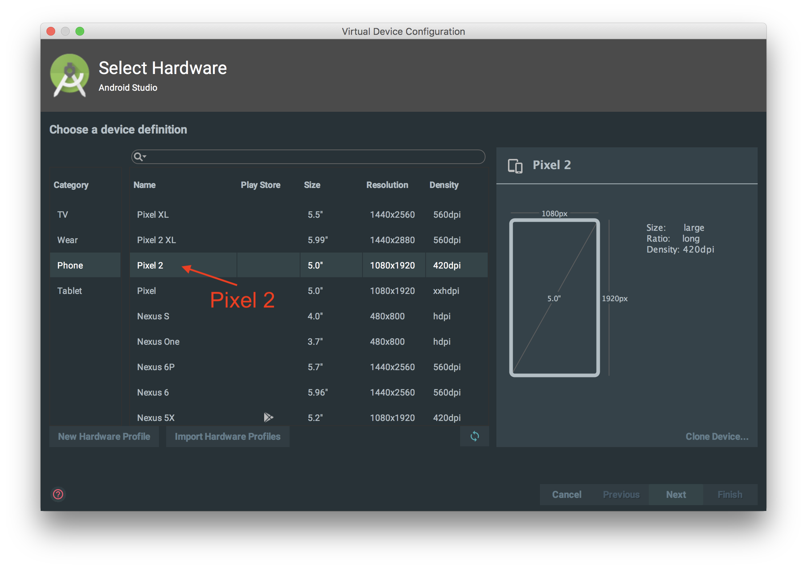
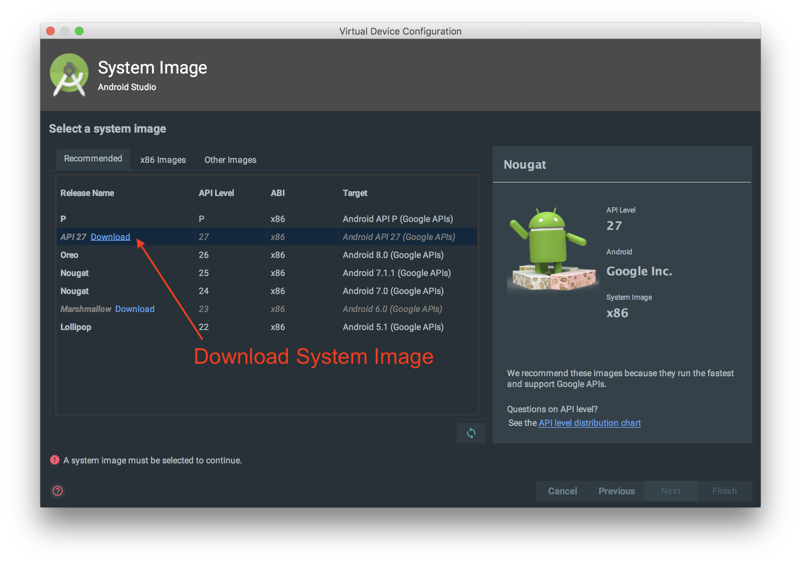
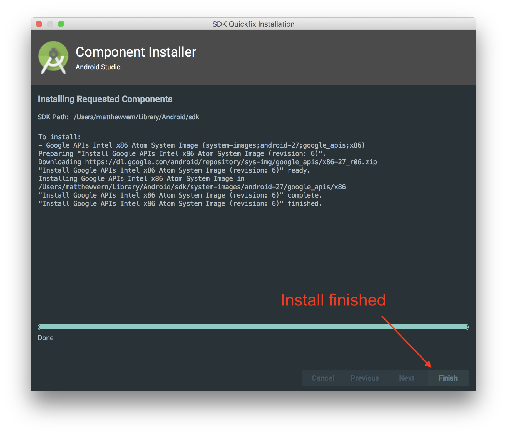
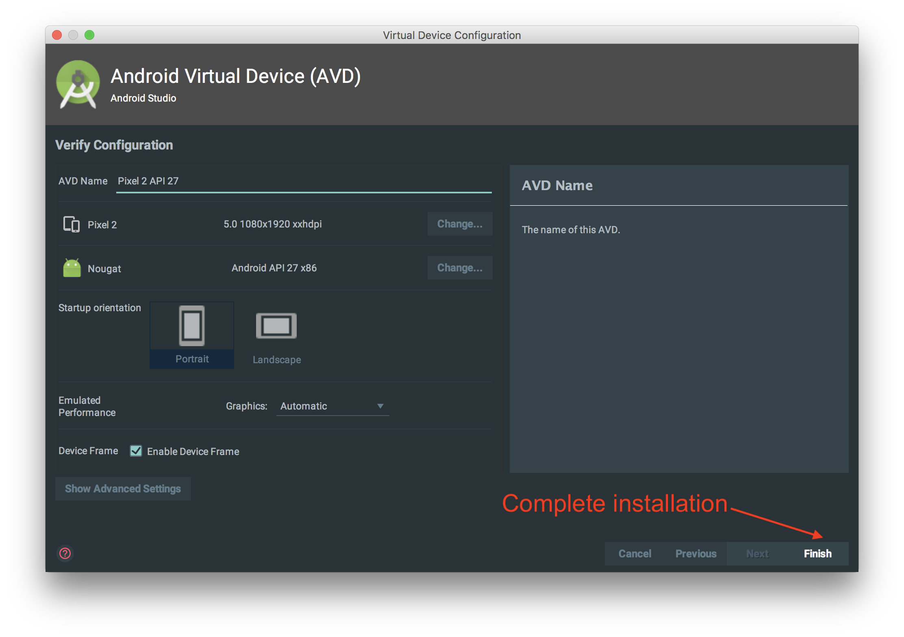
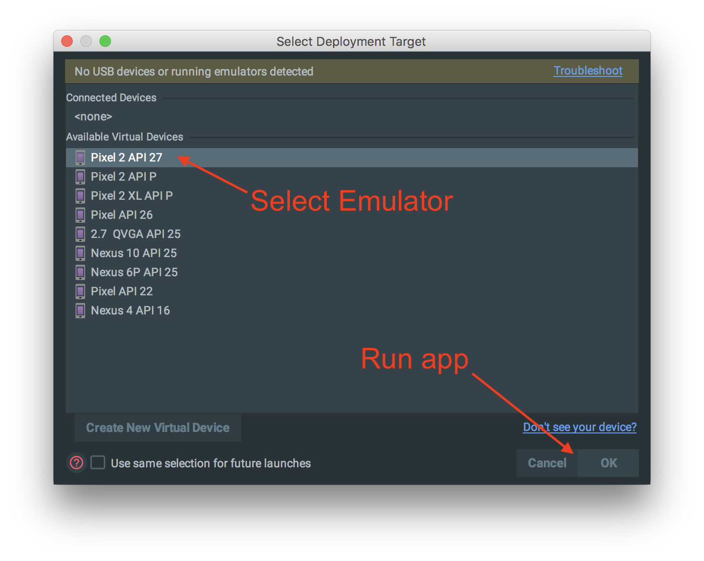

# MokuMokuNotes_Android
Made for iOS engineers who want to try Android. Install Android Studio, and then by
fixing the Compile & Runtime errors, build an Android app.
1. Install Android Studio (https://d.android.com/studio)
2. Kotlin basics (http://nilhcem.com/swift-is-like-kotlin/)
3. Android 基礎知識 (http://mixi-inc.github.io/AndroidTraining/introductions/1.04.basic-knowledge.html)
4. Android MVVM pattern (https://qiita.com/rmakiyama/items/779cf6407f70b40e4ee7)
5. Quests
   - Running an Android app
   - Kotlin TODO("message") function
   - RecyclerView & Adapter
   - Binding to ViewModel
   - Kotlin scoped functions
   - Option Menus
   - Inflating Fragments/Views
   - Communicating with ViewModels
   - Updating View XML
   - Observing LiveData
   
## Quests

### Running an Android App
Once you have cloned the App, lets run it! first, click the Run button in the toolbar

You will then see a window to choose your device. Lets create a new emulator!

Lets choose a `Pixel 2` as our device, and press next.

We need to install a system image, so lets download one.

Once the system image is installed, press finish, and then continue next.

From here, we press finish, and our emulator will be created.

Then, we can select our Emulator and run the app!

## Author
[Panini](https://twitter.com/callipan)

Feedback/PRs are welcome!
